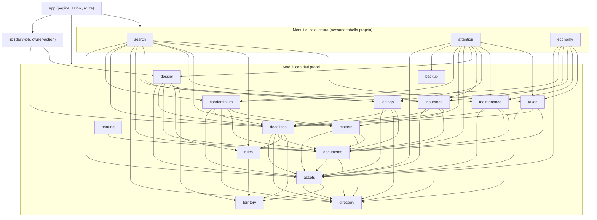

# Architettura

Documento tecnico di «Gestione Immobili»: com'è fatto il codice, quali regole di dipendenza lo tengono in ordine e dove sta ogni cosa. Le scelte e il loro perché sono in [`DECISIONS.md`](../DECISIONS.md) (le sigle `D…` ed `E…` rimandano a lì); i comandi e le procedure di tutti i giorni sono in [`CONTRIBUTING.md`](../CONTRIBUTING.md) e nel [`RUNBOOK.md`](RUNBOOK.md). Ciò che qui è scritto è stato riscontrato sul codice; dove una cosa **non** è stata provata è detto.

Contesto: app web personale (un solo proprietario, Italia, interfaccia in italiano). Next.js 16 (App Router, build di produzione), React 19, TypeScript, Drizzle ORM su Postgres (`pg` in produzione, PGlite nei test e nello sviluppo locale), Better Auth, next-intl (solo italiano), Tailwind 4 e shadcn/ui, Vitest, Playwright, dependency-cruiser. Tutto il codice sta in `app/`; il repository git è alla radice.

## 1. Livelli e regole di dipendenza

```
src/
  app/          route Next.js sottili (pagine, azioni del server, route HTTP)
  components/   componenti React condivisi (UI di base in components/ui, shadcn)
  lib/          colla fra app e moduli (owner-action, daily-job, format, ids, auth-client)
  modules/<m>/  un dominio di business: domain / application / infrastructure + index.ts (+ client.ts)
  platform/     db, audit, auth, config, clock, storage: servizi trasversali
  shared/       utility pure (denaro, date, CSV, ICS, calcolo delle date, archivio ZIP/cifratura)
```

Dentro ogni modulo il verso delle dipendenze è `domain` ← `application` ← `infrastructure`:

- **`domain/`** contiene regole pure (tipi, validazioni Zod, calcoli). Non importa nulla da `application`, `infrastructure`, `platform` o `app`, né librerie di I/O.
- **`application/`** contiene i casi d'uso, che parlano con **porte** (interfacce, `ports.ts`) e non con gli adattatori concreti.
- **`infrastructure/`** contiene gli adattatori (repository Drizzle, posta, disco).
- **`index.ts`** è l'**interfaccia pubblica** del modulo: costruisce le dipendenze concrete (`drizzle…Repository(uow.tx)`) e le espone come funzioni. Le scritture ricevono una `UnitOfWork`, le letture un `Db`.
- **`client.ts`** (presente in `assets`, `deadlines`, `directory`, `documents`, `dossier`, `lettings`, `rules`) è un secondo punto d'ingresso con **solo costanti e tipi** per i componenti del browser: l'`index.ts` porta con sé database e storage e non deve finire nel bundle client (E18, E49).

Le regole sono applicate da `pnpm arch` (configurazione: `app/.dependency-cruiser.cjs`) e da `app/tests/architecture.test.ts`:

| Regola (nome in dependency-cruiser) | Cosa vieta |
|---|---|
| `no-circular` | dipendenze circolari |
| `domain-is-pure` | `domain` che importa da `application`/`infrastructure`/`ui` dello stesso modulo, da `platform` o da `app` |
| `domain-no-io-packages` | `domain` e `shared` che importano `next`, `react`, `react-dom`, `pg`, `drizzle-orm`, `better-auth`, `@better-auth/*` |
| `application-no-infrastructure` | un caso d'uso che importa un adattatore |
| `modules-only-via-index` | un modulo che importa da un altro modulo qualcosa che non sia il suo `index.ts` |
| `platform-no-modules` | `platform` che conosce i moduli di business |
| `shared-is-leaf` | `shared` che importa da `modules`, `platform` o `app` |

`architecture.test.ts` aggiunge che nessun nome di Comune o Regione compaia in `src`, `drizzle` e `messages`: i territori sono dati, non codice. Altri test statici trasversali sono nel §9.

`pnpm arch` richiede **Node 24** (dependency-cruiser non supporta Node 25, E2). Con un Node diverso:

```bash
npx -y node@24 node_modules/dependency-cruiser/bin/dependency-cruiser.mjs src --config .dependency-cruiser.cjs
```

All'ultimo controllo l'esito era «no dependency violations found» (373 moduli, 2113 dipendenze).

## 2. Mappa dei moduli

Il grafo qui sotto è ricavato dall'output reale di dependency-cruiser (`--output-type json` con `--collapse` su ogni cartella di modulo, poi riportato in Mermaid; per averne uno automatico si usa `--output-type mermaid`). Per leggibilità **non** sono disegnate le frecce verso `platform/db`, `platform/audit` e `shared`, da cui dipendono quasi tutti (vedi la tabella).



Le frecce fra moduli sono tutte verso un `index.ts` (lo garantisce `modules-only-via-index`). Sono dipendenze di **codice**: ad esempio `dossier → deadlines` significa che il dossier chiama `syncDerivedDeadlines`, non che le scadenze dipendano dal dossier.

### Responsabilità e dipendenze

Le dipendenze verso `platform` sono quelle misurate da dependency-cruiser; `db` = `platform/db`, `audit` = `platform/audit`, `shared` = `src/shared`. `directory`, `territory` e `backup` non dipendono da nessun altro modulo.

| Modulo (`src/modules/…`) | Responsabilità | Si appoggia ai moduli | Si appoggia a platform / shared |
|---|---|---|---|
| `territory` | Gerarchia Stato › Regione › Provincia › Comune › Località a dati; import ISTAT; ricerca | — | db, audit, shared |
| `directory` | Rubrica di persone ed enti con più ruoli (nessun accesso per loro) | — | db, audit, shared |
| `assets` | Immobili e pertinenze (stesso record): titolarità con quote, catasto a storico, collegamenti dichiarati, caratteristiche tecniche | directory, territory | db, audit, shared |
| `documents` | File con metadati e versioni, categorie a dati, collegamento ai beni, ricerca nel testo dei PDF, duplicati | assets, directory | db, audit, storage, shared |
| `rules` | Regole versionate come dati, condizioni validate, motore di valutazione puro (`evaluateRules`) | territory | db, audit, shared |
| `dossier` | Voci del dossier di ogni bene (manuali o derivate dalle regole), stato scelto dal proprietario, riepilogo | assets, deadlines, documents, lettings, rules, territory | db, audit, clock, shared |
| `deadlines` | Scadenze con regola di calcolo relativa, date con stato e prove, avvisi (in app ed email), giro giornaliero idempotente, calendario `.ics` | assets, directory, documents, rules, territory | db, audit, clock, config, shared |
| `matters` | Pratiche: contatti incaricati, richieste di documenti, pareri «informativi» o «validati formalmente» | assets, directory, documents | db, audit, clock, shared |
| `sharing` | Pacchetti ZIP di condivisione (snapshot, tetto di riservatezza, registro) | documents | db, audit, storage, shared |
| `condominium` | Millesimi, esercizi, preventivi e rate, assemblee e delibere, lavori, sinistri, contratti | assets, deadlines, directory, documents, matters | db, audit, clock, shared |
| `taxes` | Tipi di tributo scritti dal proprietario, voci per bene e anno, pagamenti con prova, dichiarazioni, riepilogo per il consulente | assets, deadlines, documents | db, audit, clock, shared |
| `maintenance` | Interventi con preventivi, avanzamenti e fatture; garanzie; piani di ispezione periodica | assets, deadlines, directory, documents | db, audit, clock, shared |
| `insurance` | Polizze, garanzie copiate a mano, premi, sinistri e comunicazioni | assets, deadlines, directory, documents, matters | db, audit, clock, shared |
| `lettings` | Locazioni e ricettività: contratto, parti, canoni, codici, adempimenti | assets, deadlines, directory, documents | db, audit, clock, shared |
| `backup` | Backup cifrato, esportazione completa, storico, ripristino su ambiente vuoto | — | db, audit, config, storage, shared |
| `economy` | Quadro economico: somma di ciò che gli altri moduli hanno registrato, per anno e immobile (sola lettura) | assets, condominium, insurance, lettings, maintenance, taxes | db, shared |
| `attention` | «Da controllare»: fatti ricavati dai dati degli altri moduli (sola lettura) | assets, backup, condominium, deadlines, documents, dossier, insurance, lettings, maintenance, taxes | clock, db, shared |
| `search` | Ricerca globale in tutte le sezioni (sola lettura, non registra cosa si cerca) | assets, condominium, deadlines, directory, documents, insurance, lettings, maintenance, matters, rules, taxes | db |

Fuori dai moduli:

| Parte | Dove | Cosa fa |
|---|---|---|
| `platform/db` | `src/platform/db/` | `getDb()` (singleton su `globalThis`, E5), tipo `Db` comune ai driver, `runInUnitOfWork`, schema Drizzle (`schema/*`) |
| `platform/audit` | `src/platform/audit/index.ts` | `createAuditRecorder`, `verifyAuditChain`, `listAuditEntries`, `listAuditAreas`, `auditHead` |
| `platform/auth` | `src/platform/auth/` | `getAuth()` (Better Auth), `requireOwner`, `getOwnerForApi`, `getOwnerSetup`, `bootstrapOwner` |
| `platform/config` | `src/platform/config/env.ts` | Variabili d'ambiente validate al primo uso (Zod); negli errori solo i **nomi**, mai i valori |
| `platform/clock` | `src/platform/clock/index.ts` | Tempo iniettato (`todayInItaly`, orologio fisso nei test) |
| `platform/storage` | `src/platform/storage/` | `StoragePort` (put/get/exists/delete) e adattatore su disco (`STORAGE_DIR`, predefinito `.storage/`). **L'adattatore Blob/S3 non c'è** (E15) |
| `shared` | `src/shared/` | `money`, `dates`, `csv`, `ics`, `calc` (date relative a un'ancora), `result`/`zod` (validazione), `archive/` (ZIP, cifratura, flussi) |
| `lib` | `src/lib/` | `owner-action.ts`, `daily-job.ts`, `format.ts`, `ids.ts`, `utils.ts`, `auth-client.ts` |
| `proxy` | `src/proxy.ts` | CSP con nonce per richiesta (vedi §4) |

`lib/daily-job.ts` orchestra due moduli (`dossier` e `deadlines`) in una sola unità di lavoro: è colla fra `app` e moduli, non un modulo.

## 3. Percorso di scrittura

Ogni scrittura passa da **`runInUnitOfWork(db, actor, work)`** (`src/platform/db/unit-of-work.ts`): apre **una transazione**, passa al caso d'uso `{ tx, audit }` e chiude. Il caso d'uso modifica i dati con `uow.tx` e registra cosa ha fatto con `uow.audit.record({ action, entityType, entityId, diff })`. Se la modifica fallisce non esiste l'audit; se l'audit fallisce non esiste la modifica.

```
Azione del server / route
  └─ requireOwner()  (oppure getOwnerForApi() → 401)
      └─ ownerAction(work, paths)          src/lib/owner-action.ts
          └─ runInUnitOfWork(getDb(), { type: "owner", id }, work)
              ├─ funzione pubblica del modulo (index.ts) con la UnitOfWork
              │    └─ caso d'uso → repository(tx)  +  audit.record(...)
              └─ INSERT in audit_log  →  trigger BEFORE INSERT (catena di hash)
```

`ownerAction` e `ownerActionWithValue` fanno `requireOwner()`, aprono l'unità di lavoro e ricaricano i percorsi indicati (`revalidatePath`). Le azioni che devono fare più passi nella stessa transazione (per esempio salvare un bene e rivalutarne il dossier) chiamano `runInUnitOfWork` direttamente (`src/app/(app)/immobili/actions.ts`).

**Cosa registra l'audit**: solo **nomi** di azioni (`<entità>.<azione>`, es. `asset.create`), di campi cambiati, identificativi e conteggi. **Mai valori** (E11). È una convenzione dei casi d'uso; un test la verifica esplicitamente solo per gli eventi `backup.*` (`tests/backup.test.ts`).

### La catena di hash (nel database, non nell'applicazione)

Definita in `app/drizzle/0000_audit_log.sql` e `0001_audit_chain.sql`:

- **Trigger `audit_log_chain`** (BEFORE INSERT, `audit_log_before_insert`): prende un lock di transazione (`pg_advisory_xact_lock(hashtext('audit_log_chain'))`), assegna `seq` (precedente + 1), `at` (`clock_timestamp()`), `prev_hash` (hash della riga precedente, oppure `GENESIS`) e `hash` = SHA-256 della riga serializzata come array JSON (`audit_log_compute_hash`). Gli scrittori sono serializzati finché la transazione non termina.
- **Trigger `audit_log_no_update_delete`** (BEFORE UPDATE OR DELETE, per riga) e **`audit_log_no_truncate`** (BEFORE TRUNCATE): lanciano un'eccezione `integrity_constraint_violation`. La tabella è append-only.
- **`audit_log_verify()`**: ricalcola tutta la catena e restituisce il `seq` della prima riga che non torna, oppure `NULL`. `verifyAuditChain` la chiama; in interfaccia compare come «Verifica ora» (`/impostazioni/registro`), solo su richiesta.

**Limiti** (dichiarati, non nascosti): rileva modifiche ai campi, righe tolte nel mezzo e righe inserite fuori catena. **Non** rileva la rimozione delle **ultime** righe, a meno di confrontare l'hash di testa con una copia esterna: per questo ogni backup registra l'hash di testa (`backup_run`, manifest dell'archivio) e l'interfaccia lo mostra accanto a quello attuale (E26, E56). Chi possiede il database può disattivare i trigger: l'audit rende evidente, non impossibile, una manomissione. Il test di concorrenza sull'audit ha valore pieno solo sul Postgres reale della CI, perché PGlite non è Postgres vero (E3).

Un secondo meccanismo analogo protegge le regole: il trigger `rule_version_guard` (migrazione `0007_rules_dossier.sql`) vieta di cancellare una `rule_version` e di modificarne qualunque campo tranne `verification_status` (E27).

## 4. Modello di accesso

**Un solo proprietario**, garantito due volte: dall'indice univoco `user_single_owner` sulla tabella `user` (migrazione `0003_single_owner.sql`) e da un hook `databaseHooks.user.create.before` in `src/platform/auth/auth.ts`. La registrazione pubblica è spenta; l'account si crea dalla pagina `/configurazione-iniziale` con `OWNER_BOOTSTRAP_TOKEN` (confronto a tempo costante, solo finché non esiste un utente; il token va poi tolto dall'ambiente).

**Metodi di accesso** (E6):

- **Passkey** (primario): credenziali «discoverable» e verifica dell'utente obbligatoria (`residentKey: "required"`, `userVerification: "required"`). Con una passkey Better Auth **non** chiede il secondo fattore: la verifica dell'utente vale già come due fattori.
- **Password + TOTP**, oppure **codice di recupero** (10 codici da 10 caratteri, memorizzati cifrati): via di riserva. Password da 12 a 128 caratteri. Dopo 10 secondi fattori sbagliati l'account si blocca per 15 minuti.
- Per **usare l'app** servono TOTP attivo **e** almeno una passkey (`getOwnerSetup(...).complete`); finché la configurazione non è completa si viene portati a `/sicurezza/configurazione`.
- Sessione: 7 giorni (`expiresIn`), rinnovata al più una volta al giorno (`updateAge`), «fresca» per 10 minuti (`freshAge`, ma nessun codice dell'app ne tiene conto: vedi [`SECURITY.md`](../SECURITY.md)); **nessuna cache nel cookie** (`cookieCache.enabled: false`): una sessione revocata smette di valere subito.
- Limite di frequenza di Better Auth **nel database** (non in memoria, E7), per indirizzo letto da `x-real-ip`: 60 richieste/minuto in generale, 5 per `/sign-in/email` e `/two-factor/*`, 10 per `/sign-in/passkey`.
- Ogni accesso scrive un evento `auth.sign_in` nell'audit (con indirizzo e user agent).

**Dove si verifica la sessione.** Il controllo vero sta **al livello dei dati**, in ogni punto d'ingresso:

| Punto d'ingresso | Come |
|---|---|
| Pagina dell'area riservata (`src/app/(app)/**/page.tsx`) | `await requireOwner()` (reindirizza a `/accesso`, oppure a `/sicurezza/configurazione` se la sicurezza è incompleta) |
| Azione del server (`actions.ts` con `"use server"`) | `requireOwner()` direttamente, oppure `ownerAction`/`ownerActionWithValue` |
| Route HTTP (`src/app/api/**/route.ts`) | `getOwnerForApi()` → `null` ⇒ **401** (stessa condizione: sessione e sicurezza completa) |
| Layout dell'area riservata | `requireOwner()` solo **ottimistico**: i layout non si rieseguono a ogni navigazione, quindi non bastano |

Le eccezioni sono tre e sono l'elenco chiuso imposto da `tests/authz.test.ts`: le pagine di accesso e configurazione (`(auth)/accesso`, `(auth)/configurazione-iniziale`, `(auth)/sicurezza/configurazione`), l'azione `bootstrapAction`, e le route `api/auth/*` (Better Auth), `api/cron/*` (segreto) e `api/health`.

**Proxy** (`src/proxy.ts`, ex middleware di Next.js 16). Non fa controllo accessi: per ogni richiesta (esclusi asset statici e prefetch) genera un **nonce** (`crypto.randomUUID()` in base64), lo mette nell'intestazione di richiesta `x-nonce` (lo legge `src/app/layout.tsx`) e imposta la `Content-Security-Policy` con `script-src 'self' 'nonce-…' 'strict-dynamic'` e `style-src 'self' 'nonce-…'`; `frame-ancestors 'none'`, `object-src 'none'`, `base-uri 'self'`, `form-action 'self'`, `connect-src 'self'`, `upgrade-insecure-requests`. Solo con `next dev` si aggiungono `'unsafe-eval'` e `style-src … 'unsafe-inline'` (E10). Il nonce richiede il rendering dinamico: per questo `export const dynamic = "force-dynamic"` nel layout radice (E4). Gli altri header (`X-Content-Type-Options`, `Referrer-Policy`, `X-Frame-Options: DENY`, `Permissions-Policy`, `Strict-Transport-Security`, `Cross-Origin-Opener-Policy`) sono statici in `app/next.config.ts`.

## 5. Regole → dossier → scadenze → avvisi

Il filo che collega le quattro parti (E27–E37, E46):

1. **Regole** (`rules`). Una regola ha identità stabile (`rule`) e versioni immutabili (`rule_version`) con condizioni (albero JSON: `all`/`any`/`not` e `eq`, `in`, `gte`, `lte`, `exists`, `contains` su un elenco chiuso di fatti), validità, territorio, fonte, stato di verifica e **esiti**: voce di dossier e/o scadenza. Il motore `evaluateRules` è puro: riceve regole e fatti, non legge il database. In vigore alla data D: tra le versioni con validità che contiene D vince il numero più alto.
2. **Fatti del bene.** Il modulo `dossier` raccoglie i fatti (`collaborators.factsFor` in `src/modules/dossier/index.ts`): tipo, uso, condominio, regimi di titolarità in corso, **caratteristiche tecniche** (`attributes.*`), tipi di locazione attivi (`letting.types`, da `lettings`) e la catena di territori del bene (da `territory`). Un fatto mancante rende falso il confronto, non genera un errore.
3. **Dossier** (`dossier_item`). `evaluateDossier` (un bene) e `evaluateAllDossiers` (tutti) derivano le voci dagli esiti: titolo, categoria, versione e spiegazione sono del motore; **stato, nota e documenti collegati sono solo del proprietario** e non si sovrascrivono mai. Una regola che non vale più lascia la voce con `stale = true` («da rivedere»), mai cancellata.
4. **Scadenze** (`deadline` con `origin = 'rule'`). Gli esiti «scadenza» passano da `syncDerivedDeadlines` (modulo `deadlines`), con unicità su (bene, chiave regola, chiave esito) (`deadline_rule_uq`). Le date (`deadline_occurrence`) si calcolano **relative a un'ancora** (annuale fissa, relativa a una data, ricorrente, manuale), mai da un'occorrenza precedente; lo spostamento al giorno lavorativo usa i festivi **a dati** (`holiday_rule`). Si generano in un orizzonte da oggi a +400 giorni (`HORIZON_DAYS`).
5. **Avvisi** (`notification`). `runDailyCycle` crea gli avvisi dovuti, con chiave unica (scadenza, giorni di preavviso, data) (`notification_key_uq`) che rende il giro idempotente. Preavvisi per priorità; per i ritardi escalation a 1, 3, 7, 14, 30 giorni e poi ogni 30, fino a 365 (`ESCALATION_STEPS`, `STOP_ESCALATION_AFTER_DAYS`). L'email passa da `MailPort` (adattatore Resend: **mai provato con un account reale**); si inviano solo gli avvisi creati dopo l'attivazione delle email.

**Quando gira la valutazione** (sempre nella stessa transazione della modifica):

| Evento | Dove |
|---|---|
| Salvataggio, archiviazione o ripristino di un bene | `src/app/(app)/immobili/actions.ts` → `evaluateDossier` |
| Pulsante «Rivaluta» del dossier | `src/app/(app)/immobili/[id]/dossier/actions.ts` |
| Cambio delle locazioni di un bene | `src/app/(app)/locazioni/actions.ts` → `evaluateDossier` |
| Pubblicare, attivare, disattivare, verificare una regola, caricare le regole di esempio, rivalutare tutto | `src/app/(app)/regole/actions.ts` → `evaluateAllDossiers` |
| **Giro giornaliero** | `runDailyJob` (`src/lib/daily-job.ts`): `evaluateAllDossiers` + `runDailyCycle`, chiamato da `/api/cron/giornaliero` e dal pulsante in Impostazioni › Notifiche |

Il giro giornaliero serve a cogliere il passare delle **date di validità** delle regole (E31, E37). Pianificato alle 05:00 UTC in `app/vercel.json`; **mai provato su Vercel**.

Le scadenze collegate ad altri moduli (rate di condominio, pagamenti, garanzie, ispezioni periodiche) seguono i dati: si chiudono a importo coperto o adempimento eseguito, si riaprono se il dato viene corretto, si archiviano quando la voce è sostituita o tolta (E47).

## 6. Tabelle per modulo

Elenco ricavato da `src/platform/db/schema/*` (una voce `pgTable` per tabella). I file di schema non coincidono sempre con i moduli: la colonna «File» dice dove sta la definizione.

| Modulo | Tabelle | File di schema |
|---|---|---|
| platform/audit | `audit_log` | `audit.ts` |
| platform/auth | `user`, `session`, `account`, `verification`, `passkey`, `two_factor`, `rate_limit` | `auth.ts` (**generato** da Better Auth con `pnpm auth:schema`, E8) |
| territory | `territory` | `registry.ts` |
| directory | `party` | `registry.ts` |
| assets | `asset`, `ownership_right`, `asset_link`, `cadastral_record` | `registry.ts` |
| documents | `document_category`, `file_object`, `document`, `document_version`, `document_asset` | `documents.ts` |
| rules | `rule`, `rule_version` | `rules.ts` |
| dossier | `dossier_category`, `dossier_item`, `dossier_item_document` | `rules.ts` |
| deadlines | `holiday_rule`, `deadline`, `deadline_occurrence`, `deadline_proof`, `notification`, `app_setting` | `deadlines.ts` |
| matters | `matter`, `matter_assignment`, `matter_document_request`, `professional_opinion`, `matter_document` | `matters.ts` |
| sharing | `share_package`, `share_package_item`, `share_log` | `matters.ts` |
| condominium | `condominium`, `condo_membership`, `millesimal_table`, `millesimal_share`, `condo_fiscal_year`, `condo_budget`, `condo_installment`, `condo_meeting`, `condo_agenda_item`, `condo_agenda_document`, `condo_proxy`, `condo_resolution`, `condo_work`, `condo_work_entry`, `condo_claim`, `condo_contract`, `condo_document` | `condominium.ts` |
| taxes | `tax_type`, `tax_obligation`, `tax_payment`, `tax_return` | `taxes.ts` |
| maintenance | `maint_work`, `maint_quote`, `maint_invoice`, `maint_progress`, `maint_warranty`, `maint_inspection_plan` | `maintenance.ts` |
| insurance | `ins_policy`, `ins_policy_asset`, `ins_coverage`, `ins_premium`, `ins_claim`, `ins_claim_entry` | `insurance.ts` |
| lettings | `letting`, `letting_party`, `letting_rent`, `letting_code`, `letting_report` | `lettings.ts` |
| backup | `backup_run` | `backup.ts` |
| economy, attention, search | nessuna (sola lettura) | — |

Le migrazioni stanno in `app/drizzle/` (numerate in ordine a partire da `0000_audit_log.sql`; l'elenco è nella cartella e in `drizzle/meta/_journal.json`). Contengono anche SQL scritto a mano che Drizzle non genera: funzioni e trigger dell'audit, il trigger delle regole, l'indice `user_single_owner`, i dati di partenza (categorie, festivi). La CI esegue `drizzle-kit generate` e fallisce se compaiono file nuovi in `drizzle/`: lo schema non può cambiare senza una migrazione.

## 7. Backup e archivio

Modulo `backup` (`src/modules/backup`), formato in `domain/archive.ts`, cifratura in `src/shared/archive/crypto.ts`.

**Formato dell'archivio** (`ARCHIVE_FORMAT_VERSION = 1`): un file ZIP con `manifest.json` (versione, data, impronte delle migrazioni applicate, righe e SHA-256 per tabella, file con dimensione e impronta, file mancanti, **hash di testa dell'audit**), `data/<tabella>.ndjson` (una riga JSON per record), `files/<chiave>` (i byte originali dello storage) e `LEGGIMI.txt`. Si legge anche senza l'app.

**Backup cifrato** (E21): l'intero ZIP è cifrato con la chiave **pubblica** del proprietario (`BACKUP_PUBLIC_KEY`): AES-256-GCM a blocchi da 1 MiB, con la chiave dati avvolta con RSA-OAEP-SHA256 (RSA 3072). Intestazione `GIBK`, versione, nonce base; intestazione, contatore del blocco e segno «ultimo» entrano nei dati autenticati, quindi un blocco tolto, spostato o un file troncato fanno fallire la lettura. La chiave **privata** la genera `pnpm backup:keygen`, non sta mai sul server e **non si può recuperare**: il server scrive i backup ma non può aprirli. Il backup **include** le tabelle delle credenziali (`user`, `account`, `passkey`, `two_factor`: servono a ripristinare l'accesso), ma solo cifrate.

**Esportazione completa** (E22): stesso formato, **in chiaro** e **senza** credenziali; da Impostazioni › Backup o `GET /api/esportazione`.

**Quali tabelle** (`domain/archive.ts`):

- `BUSINESS_TABLES`: tutte quelle dell'applicazione, in ordine di reinserimento (le chiavi esterne puntano all'indietro), `audit_log` compresa.
- `AUTH_TABLES`: `user`, `account`, `passkey`, `two_factor`, solo nel backup cifrato.
- `EXCLUDED_TABLES` (con il motivo): `session` (si rifà l'accesso), `verification` (codici temporanei), `rate_limit` (contatori), `backup_run` (storico dell'ambiente corrente).
- `SEEDED_TABLES`: `document_category`, `dossier_category`, `holiday_rule`, riempite dalle migrazioni; nel ripristino si svuotano prima, vale ciò che sta nell'archivio.
- Un test (`tests/backup.test.ts`) **fallisce** se una tabella dello schema non è in nessuno degli elenchi, o se una migrazione riempie un'altra tabella.

**Ripristino** (`pnpm backup:restore --archive <f.gibk> --key <privata.pem> [--verify-only]`, `restoreArchive`): solo su un ambiente **vuoto** con lo **stesso schema** (impronte delle migrazioni uguali). Verifica formato, impronta di ogni tabella e di ogni file, e la catena dell'audit (la riga di testa deve coincidere con quella del manifest). Tutto in una transazione; i file scritti vengono rimossi in caso di errore. `--verify-only` controlla un archivio senza scrivere.

**Destinazione**: oggi una cartella su disco (`BACKUP_DIR`, ultimi `BACKUP_KEEP` = 14 tenuti, di default), che sullo stesso disco dell'app **non è una vera seconda copia**. Un secondo fornitore richiede un altro adattatore di `BackupDestination`: **non esiste** (E24). Il cron `/api/cron/backup` esiste ma non è in `vercel.json` (su Vercel il filesystem è a sola lettura, E15).

## 8. Struttura dei file

| Cosa | Dove |
|---|---|
| Pagine, azioni e route | `app/src/app/` — `(app)/` area riservata, `(auth)/` accesso e configurazione, `api/` route HTTP; file `actions.ts` per le azioni del server di ogni sezione |
| Messaggi dell'interfaccia | `app/messages/it.json` (chiavi tipizzate via `app/src/global.d.ts`; configurazione in `src/i18n/request.ts`) |
| Moduli di business | `app/src/modules/<m>/` |
| Piattaforma, utility, colla | `app/src/platform/`, `app/src/shared/`, `app/src/lib/` |
| Componenti | `app/src/components/` (comuni), `app/src/components/ui/` (shadcn), `_components/` accanto alle pagine che li usano |
| Schema e migrazioni | `app/src/platform/db/schema/`, `app/drizzle/` |
| Script | `app/scripts/` (`dev-db`, `migrate`, `backup-*`, `import-istat`, `auth-cli-config`) |
| Test | `app/tests/` (Vitest), `app/e2e/` (Playwright), `app/tests/helpers/` e `app/e2e/support/` |
| CI e dipendenze | `.github/workflows/ci.yml`, `.github/workflows/security.yml`, `.github/dependabot.yml` |
| Decisioni, registro, manuale | `DECISIONS.md`, `docs/REGISTRO_CODEBASE.yaml`, `docs/RUNBOOK.md` |

## 9. Strategia di test

Tre livelli, più i controlli che guardano tutta l'app.

**Unitari e di integrazione (Vitest, `app/tests/`, `pnpm test`).** I test di dominio sono funzioni pure (con `fast-check` dove serve). Quelli di integrazione usano `createTestDb()` (`tests/helpers/test-db.ts`): un **PGlite** in-process con le migrazioni vere, un database nuovo a ogni chiamata, nessun Docker. Con `TEST_DATABASE_URL` gli stessi test girano su un Postgres reale (la CI li esegue due volte, con PGlite e con Postgres 17); `createTestDb` rifiuta database il cui nome non contiene «test», perché cancella lo schema `public`, e con un database reale i file non girano in parallelo (`fileParallelism`). Un ripristino di backup si prova con un secondo database in memoria (`inMemory: true`).

**End-to-end (Playwright, `app/e2e/`, `pnpm exec playwright test`).** Girano contro la **build di produzione** (`pnpm build` + `next start` sulla porta 3100): è l'unico modo di verificare CSP con nonce e cookie come saranno online. Il database è un PGlite in memoria esposto su un socket (`e2e/support/db-server.ts`, porta 54329, massimo 2 connessioni; l'app usa `DATABASE_POOL_MAX=1`). Un solo worker, file in ordine alfabetico sullo stesso database: ogni file ripulisce ciò che inserisce (l'audit, append-only, fa eccezione). Un file di setup (`auth.setup.ts`) crea l'account di prova con passkey virtuale e TOTP e salva lo stato di sessione. Ogni file usa un indirizzo `x-real-ip` distinto (vedi [`CONTRIBUTING.md`](../CONTRIBUTING.md)).

**Test statici trasversali** (leggono i sorgenti, falliscono se una regola viene dimenticata):

| Test | Cosa impone |
|---|---|
| `tests/architecture.test.ts` (+ `pnpm arch`) | nessun nome di Comune o Regione nel codice; confini fra livelli e moduli |
| `tests/authz.test.ts` | ogni pagina, route e azione verifica la sessione; elenco chiuso delle eccezioni; nei file `"use server"` si esportano solo funzioni async |
| `tests/messages.test.ts` | ogni chiave `t("…")` usata nel codice esiste in `messages/it.json` |
| `tests/neutral-language.test.ts`, `e2e/neutral-language.spec.ts` | nessun messaggio, stringa o schermata dà un verdetto (conforme, in regola, non dovuto, valido…) |
| `tests/client-boundary.test.ts` | il codice del browser non importa indici di moduli, piattaforma né `process.env` |
| `tests/problem-pages.test.ts`, `e2e/problem-pages.spec.ts` | un errore mostra solo il codice `digest`; un indirizzo inesistente risponde 404 e non 200 (con un `loading.tsx` a livello `(app)` risponderebbe 200: nessun test cerca quel file, a pescare l'errore è l'e2e) |
| `tests/backup.test.ts` | ogni tabella è nell'archivio o esclusa con un motivo |
| `tests/health.test.ts`, `tests/csv.test.ts`, `tests/ics.test.ts` | `/api/health`, CSV a prova di formule, file `.ics` corretto |
| `tests/docs-routes.test.ts`, `tests/docs-links.test.ts` | ogni `route.ts` è in `docs/API.md`; ogni link relativo dei documenti punta a un file che esiste |
| `e2e/accessibility-responsive.spec.ts` | accessibilità WCAG 2.x A/AA (axe) di tutte le schermate in `e2e/support/pages.ts` a 1280 e 390 px |

`pnpm check` esegue tipi, lint, confini e test (non gli e2e). Il `next build` controlla i tipi anche su `tests/` ed `e2e/` (vedi le trappole in [`CONTRIBUTING.md`](../CONTRIBUTING.md)).

## 10. Cosa non è provato

- Nessun deploy su Vercel e nessun database Neon: cron, email Resend, passkey sul dominio di produzione e la pipeline CI non sono mai girati su servizi reali.
- Mancano gli adattatori per i file e per i backup su Vercel (Blob o S3): oggi tutto sta su disco locale.
- PGlite non è Postgres: il comportamento concorrente dell'audit è provato davvero solo sul Postgres della CI, che non è mai stato eseguito (nessun repository remoto).
